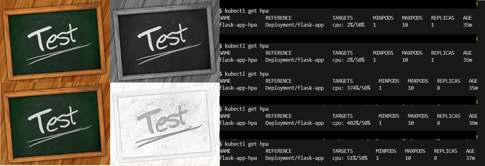

# image-processing-cluster



## Overview

This project demonstrates a scalable image processing application that applies various filters to images, designed for deployment in a Kubernetes cluster. It features built-in auto-scaling based on CPU load, ensuring efficient resource usage under varying workloads.

### Key Features

- **Image Filtering Service**: Supports multiple filters such as grayscale, blur, sharpen, and contour using `Pillow`.
- **CPU-Intensive Task Handling**: Simulates CPU-intensive computations to trigger Kubernetes Horizontal Pod Autoscaling (HPA).
- **Automatic Scaling**: Configured to dynamically adjust the number of pods based on CPU utilization, ensuring performance under heavy workloads.
- **Kubernetes Deployment**: Fully containerized using Docker and deployed on Kubernetes, leveraging both Deployment and HPA configurations.
- **Load Balancing**: Traffic to the application is managed by a Kubernetes LoadBalancer for high availability.

## Architecture

The architecture consists of a Flask-based service running in a container that performs image filtering tasks and CPU-intensive computations. The system is optimized to auto-scale when CPU load exceeds the configured threshold, ensuring optimal performance under stress.

### Technologies Used

- **Python** (Flask, Pillow)
- **Docker** for containerization
- **Kubernetes** for orchestration
- **Horizontal Pod Autoscaler** for scaling based on CPU usage

## Running Locally

To run the project locally:

1. Build the Docker image:
   ```bash
   docker build -t flask-app:latest .
   ```
2. Deploy to Kubernetes:
   ```bash
   kubectl apply -f deploy.yaml
   ```

## Testing

Use the `test.py` script to verify image processing and CPU load generation. The system will automatically scale based on CPU usage, demonstrating the efficiency of the Kubernetes HPA.
